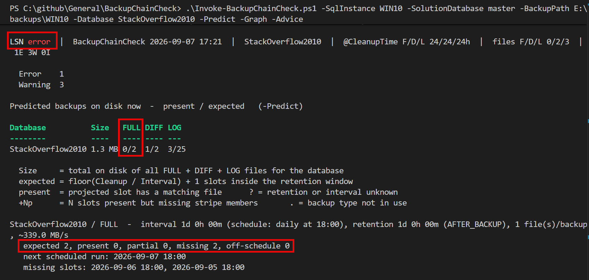
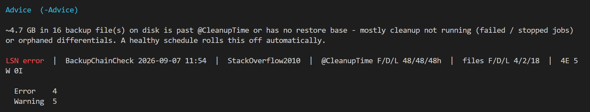
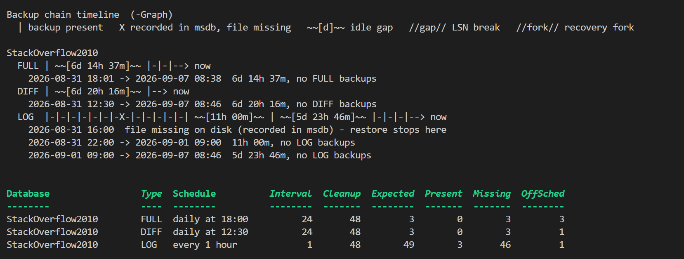
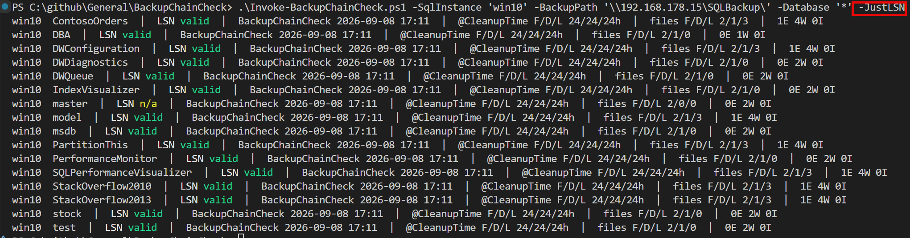

# BackupChainCheck

A read-only Windows PowerShell 5.1 tool that checks whether the SQL Server backup
files produced by [Ola Hallengren's Maintenance Solution](https://ola.hallengren.com/)
actually add up to the recovery coverage you think you have.

It does this by **reconciling things that are normally never compared**:

1. **Retention** – the `@CleanupTime` value (in hours) and other backup settings
   configured in the `DatabaseBackup` Agent job steps (or supplied via a config file).
2. **Cadence** – how often each backup type is scheduled to run (read from SQL Agent
   schedules, from `dbo.CommandLog`, or inferred from file timestamps).
3. **Reality** – the backup files that are actually present on the backup path(s).
4. **The LSN chain** – whether `msdb`'s recorded log-backup chain is actually
   continuous and every link's file is still on disk, i.e. whether a point-in-time
   restore would really work.

When those disagree, you have a gap — and the tool tells you which kind.

---

## The question this answers

> `@CleanupTime` is 48 (hours) and a FULL backup runs every morning at 06:00, but
> there is only **one** FULL backup file on disk. Is that a problem?

Yes — and it is exactly the kind of thing this tool flags.

`@CleanupTime` is **not a schedule and not a guaranteed copy count**. It only means
*"after a successful backup, delete files of this database + this backup type that are
older than N hours."* (With `@CleanupMode = 'AFTER_BACKUP'`, the default, the delete
is skipped entirely if the backup fails.)

So retention + cadence imply an **expected file count**. Put the backups on an age
axis — one every `Interval` hours, newest at age ~0 — and retention keeps every one
younger than `Cleanup`:

```
age →   0         I         2I         3I
        |         |         |          ·         ( · = deleted, age > Cleanup )
       now      −1 bkp    −2 bkp
        └─────────── Cleanup window ────────────┘

expected files per (database, backup type) ≈ floor(CleanupTime / IntervalHours) + 1
                                             (× @NumberOfFiles if the backup is striped)
```

`CleanupTime / Interval` is how many one-interval **gaps** fit in the window;
`floor` drops the partial gap at the end; **`+ 1`** is the fencepost — N gaps have
N+1 backups, counting the fresh one at age 0 *and* the oldest still inside the
window.

| Setting                           | Interval | Files, at ages   | Expected                                  |
|-----------------------------------|----------|------------------|-------------------------------------------|
| `@CleanupTime = 48`, daily FULL   | 24 h     | 0 h, 24 h, 48 h  | **3**                                     |
| `@CleanupTime = 72`, daily FULL   | 24 h     | 0, 24, 48, 72 h  | **4**                                     |
| `@CleanupTime = 24`, daily FULL   | 24 h     | 0 h, 24 h        | **2** (briefly 1 right after cleanup)     |
| `@CleanupTime = 168`, weekly FULL | 168 h    | 0 h              | **1** – by design, but a single-copy risk |

**Two numbers, on purpose.** That last file — the one sitting right at age ≈
`Cleanup` — is not guaranteed. Cleanup only runs *at* a backup, with a cutoff set
`Cleanup` hours before *that*, so between runs the oldest survivor can reach age
`Cleanup + Interval`, and when `Cleanup` is an exact multiple of `Interval` it
balances on the edge — a slightly-long run deletes it, a slightly-short one keeps
it. So the tool treats **`floor(C/I)`** as the guaranteed floor and
**`floor(C/I) + 1`** as a healthy just-cleaned chain. Finding fewer than
`floor(C/I)` is the real problem.

Finding **1** file where the math says **3** means one of:

- the backup job has been failing or not running (most common),
- `@CleanupMode = 'BEFORE_BACKUP'` plus a recent failure wiped older copies,
- something outside Ola's solution is deleting files,
- the schedule is not really daily,
- the job was only recently deployed.

BackupChainCheck reports the discrepancy, the likely cause, and the affected
databases so you can tell which case it is.

---

## What it checks

- **Count gaps** – fewer FULL / DIFF / LOG files present than retention + cadence
  *guarantee* (`floor(C/I)`). When there is too little history on disk to be sure,
  it downgrades to a lower-confidence warning and says why.
- **LOG / DIFF chain gaps** – spacing between consecutive backups larger than
  `interval × GapToleranceFactor` (default 1.5), i.e. missing backups that break
  point-in-time recovery. All gaps for a database roll up into one finding.
- **LSN chain** (`-SqlInstance`) – from `msdb` history: each LOG's `first_lsn`
  equals the previous `last_lsn` (contiguous, one recovery fork), no `is_damaged`
  backup, no LOG recorded in `msdb` inside the on-disk chain window whose file
  has gone missing, and – with a backup path to check – **at least one FULL
  backup file still on disk** for any database that has a LOG/DIFF chain (a
  chain with no base restores nowhere). Reported as the `LSN valid` / `error`
  headline plus findings.
- **DIFF base** (`-SqlInstance`) – each retained differential's
  `differential_base_lsn` matches a FULL that is still in the history window.
- **Roll-forward coverage** – the oldest retained FULL has a LOG chain starting at
  or before it. `@CleanupTime` for LOG shorter than for FULL leaves your *oldest*
  full backups unrecoverable-forward.
- **Retention consistency**
  - `@CleanupTime(LOG)  >= @CleanupTime(FULL)` and `@CleanupTime(DIFF) <= @CleanupTime(FULL)`
  - `@CleanupTime <  IntervalHours` → risk of **zero** valid backups right after a cleanup.
  - `@CleanupTime` not a whole multiple of the interval → the copy count oscillates.
  - `@CleanupMode = 'BEFORE_BACKUP'` → old copies deleted before the new backup runs.
- **Stale / orphan files** – files far older than `@CleanupTime` still present
  (cleanup silently failing – permissions, striped-file mismatch, past failures).
- **Striping** – backups missing stripe members (`@NumberOfFiles` from the job, or
  inferred from the widest stripe set actually seen).
- **Failed runs** – `dbo.CommandLog` rows with a non-zero `ErrorNumber`, and
  successful runs in `CommandLog` with no matching file on disk.
- **Coverage** – ONLINE databases with no backup files under the scanned paths.
- **Recovery-model mismatch** – FULL/BULK_LOGGED databases with no LOG backups;
  LOG backups present for a SIMPLE database.
- **Configured-path mismatch** – a job's `@Directory` is not among the scanned roots.

---

## Requirements

- Windows PowerShell **5.1** (ships with Windows 10/11 and Windows Server 2016+).
  PowerShell 7 is not required and not targeted.
- Read access to the backup path(s) – local paths or UNC shares.
- *Optional:* a login on the SQL Server instance with read access to `msdb`, to
  `sys.databases`, and to `dbo.CommandLog` in the database where Ola's objects are
  installed (`SQLAgentReaderRole` + `db_datareader` on `msdb` and that database is
  enough). Without it, supply the expected retention/cadence in a config file.
- No external modules required — connectivity is plain ADO.NET
  (`System.Data.SqlClient`, built into .NET Framework).

The tool **never writes to SQL Server and never deletes or modifies backup files.**

---

## Usage

```powershell
# Reconcile against a live instance. Reads the DatabaseBackup job steps, sys.databases,
# and dbo.CommandLog (Ola's run log). -SolutionDatabase defaults to master.
.\Invoke-BackupChainCheck.ps1 -SqlInstance 'win11' -SolutionDatabase 'master' -BackupPath 'E:\backups\win11'

.\Invoke-BackupChainCheck.ps1 -SqlInstance 'SQL01' -BackupPath '\\nas01\sqlbackup'
.\Invoke-BackupChainCheck.ps1 -SqlInstance 'win10' -BackupPath '\\192.168.178.15\SQLBackup\'

# Solution installed in a dedicated DBA database
.\Invoke-BackupChainCheck.ps1 -SqlInstance 'SQL01' -SolutionDatabase 'DBA' -BackupPath 'D:\Backup'

# No SQL connection – describe expectations in a config file (see expectations.sample.json)
.\Invoke-BackupChainCheck.ps1 -BackupPath 'D:\Backup' -ConfigPath '.\expectations.json'

# Quick one-off: just check FULLs against a known retention/cadence
.\Invoke-BackupChainCheck.ps1 -BackupPath 'D:\Backup' -FullCleanupTimeHours 48 -FullIntervalHours 24

# Multiple roots, HTML report, monitoring exit code
.\Invoke-BackupChainCheck.ps1 -SqlInstance 'SQL01' `
    -BackupPath 'D:\Backup','\\nas01\sqlbackup' `
    -ReportPath '.\report.html' -FailOnGap

# Several servers in one run. Every -BackupPath root is scanned once; each server
# is reconciled against the files whose <SERVER$INSTANCE> folder matches it.
.\Invoke-BackupChainCheck.ps1 -SqlInstance 'SQL01,SQL02,SQL03' -BackupPath '\\nas01\sqlbackup'

# One greppable line per server + database, for a monitoring probe
.\Invoke-BackupChainCheck.ps1 -SqlInstance 'SQL01,SQL02' -BackupPath '\\nas01\sqlbackup' -JustLSN

# One database: design advice, predicted-vs-actual matrix, ASCII chain timeline
.\Invoke-BackupChainCheck.ps1 -SqlInstance 'SQL01' -BackupPath 'D:\Backup' `
    -Database 'Finance' -Advice -Predict -Graph

# The restore chain: the files on disk that form a valid LSN set to "now"
.\Invoke-BackupChainCheck.ps1 -SqlInstance 'SQL01' -BackupPath 'D:\Backup' `
    -Database 'Finance' -RestorePlan
```

`-Database` takes one or more `-like` wildcard patterns (default `*` = every
database) and scopes the whole analysis, not just the printed table.

`-SqlInstance` takes one or more instances (`-SqlInstance 'SQL01,SQL02'` or
`-SqlInstance SQL01,SQL02`). With more than one, the analysis runs once per
server: every `-BackupPath` root is scanned a single time and each server is
reconciled against the backup files whose parsed `<SERVER$INSTANCE>` folder
matches it. Output is a per-server block (or, under `-JustLSN`, one line per
server + database); pipeline objects carry `Instance`; `-FailOnGap` returns the
worst exit code across all servers.

With `-SqlInstance`, the analysis is limited to databases that currently exist
and are **ONLINE** in `sys.databases` — stale `dbo.CommandLog` rows and orphaned
files for dropped or renamed databases (a leftover `_ODS`, say) are ignored.
`-IncludeOfflineDatabases` keeps them.

### `-Predict` — what *should* be on disk

`-Predict` turns the retention math around: for every in-scope `(database, backup
type)` with a known retention and cadence it projects the set of backup files
that should be present right now — one slot every `IntervalHours`, back to age
`CleanupTime + IntervalHours` — and matches each slot to a real file.

```
Predicted backups on disk now  -  present / expected   (-Predict)

Database   Size     FULL  DIFF  LOG
--------   ----     ----  ----  ---
Finance    182.4 GB 3/3   4/4   2/49
Sales      41.7 GB  1/3   0/1   47/49

Finance / LOG  -  interval 1h 00m, retention 2d 0h 00m (AFTER_BACKUP), 1 file(s)/backup
   expected 49, present 2, missing 47, off-schedule 1
   missing slots: 2026-09-07 08:00, 2026-09-07 07:00, 2026-09-07 06:00, ... (+44 more)
```

The `Size` column is the total on disk of every FULL + DIFF + LOG file the scan
saw for that database (copy-only excluded).

It emits one `BackupChainCheck.Prediction` object per `(database, type)` on the
pipeline (each with a `.Slots` array of every projected slot, its age and
`present` / `partial` / `missing` status, plus `Schedule`, `NextScheduledRun`,
`IntervalSource` and `SpeedMBps`). The findings table still prints to the
console, and `-FailOnGap` still works off the findings.

The `MB/s` column in that table (and `SpeedMBps` on the object) is the median
write throughput for that `(database, type)` from `msdb` history —
`backup_size / run time` — blank for backups too small or fast to time (most
LOG backups). Needs `-SqlInstance`.

With `-SqlInstance` the projected slot times come from the **SQL Agent schedule**
on the DatabaseBackup jobs (`daily at 18:00`, `every 1 hour`, …), so "missing
slots" line up with the times the backup was actually supposed to run.



### `-Advice` — is the design sane?

`-Advice` prints a short plain-language review of the retention / cadence design
at the **top** of the output, grouped so an `ALL_DATABASES` job is stated once:

```
Advice  (-Advice)
All 16 databases:
  - DIFF is kept 7d 0h 00m but FULL only 2d 0h 00m. A differential restores only
    on its base FULL, so DIFFs older than 2d have no base on disk and cannot be
    restored - and with a daily FULL you barely need DIFFs at all. Set DIFF
    @CleanupTime to 2d to match FULL.
  - LOG is kept 1d, shorter than FULL's 2d. Continuous point-in-time restore only
    reaches back 1d ...

~4.7 GB in 16 backup file(s) on disk is past @CleanupTime or has no restore base
- mostly cleanup not running or orphaned differentials.
```

It covers: DIFF retention longer than FULL, LOG retention shorter than FULL,
`@CleanupTime` below the run cadence, a thin FULL copy count — and an approximate
figure for backup files on disk that are past `@CleanupTime` or have no restore
base (summing the file sizes the tool sees). Console only.



### `-Graph` — the chain, drawn

`-Graph` prints an ASCII timeline per `(database, type)`:

```
Backup chain timeline  (-Graph)
  | backup present   X recorded in msdb, file missing   ~~[d]~~ idle gap   //gap// LSN break   //fork// recovery fork

StackOverflow2010
  FULL | ~~[6d 14h 37m]~~ |-|-|--> now
    2026-08-31 18:01 -> 2026-09-07 08:38  6d 14h 37m, no FULL backups
  LOG  |-|-|-|-|-|-|-|-|-| ~~[11h 00m]~~ |-|-X-|-|-|-|--> now
    2026-09-07 03:00  file [SQL01_StackOverflow2010_LOG_20260907_030001.trn] missing (from msdb) - restore stops here
```

Each `|` is a backup; `X` is one that `msdb` recorded but whose file is gone;
`~~[…]~~` is an idle stretch; `//gap//` an LSN break; `//fork//` a recovery-fork
change. Console only — the pipeline is unchanged.

`X` is only drawn for a file young enough to still be inside `@CleanupTime` (plus
one interval) — a backup older than that has simply aged out of retention, so it
renders as a plain `|`. With no retention known, every missing file is flagged.



### `-RestorePlan` — the files that form a valid LSN set

`-RestorePlan` prints, per database, the **shortest sequence of backup files on
disk** that forms a valid LSN chain to the latest recoverable point: the newest
FULL on disk, then the newest DIFF on disk whose `differential_base_lsn` matches
that FULL, then every contiguous LOG on disk from there to the newest.

```
Restore chain on disk  (-RestorePlan)

StackOverflow2010
   1. FULL 2026-09-07 18:00:57  WIN10_StackOverflow2010_FULL_20260907_180057.bak
   2. DIFF 2026-09-07 18:30:04  WIN10_StackOverflow2010_DIFF_20260907_183004.bak
   3. LOG  2026-09-07 19:00:01  WIN10_StackOverflow2010_LOG_20260907_190001.trn
  -> 3 step(s), recoverable to 2026-09-07 19:00:01  [current]

    -- StackOverflow2010  ->  recoverable to 2026-09-07 19:00:01
    RESTORE DATABASE [StackOverflow2010] FROM DISK = N'...\WIN10_StackOverflow2010_FULL_20260907_180057.bak' WITH NORECOVERY;
    RESTORE DATABASE [StackOverflow2010] FROM DISK = N'...\WIN10_StackOverflow2010_DIFF_20260907_183004.bak' WITH NORECOVERY;
    RESTORE LOG      [StackOverflow2010] FROM DISK = N'...\WIN10_StackOverflow2010_LOG_20260907_190001.trn' WITH NORECOVERY;
    RESTORE DATABASE [StackOverflow2010] WITH RECOVERY;
```

Every step is `WITH NORECOVERY`, then a trailing `RESTORE DATABASE … WITH
RECOVERY;` when the chain is complete; a striped backup lists all its `DISK =`
members. Restoring on a different server may need `WITH MOVE`.

If a link's file is gone, the plan stops at the last usable file and is marked
`[PARTIAL]` with the name of the missing next backup (and the script stays all
`NORECOVERY`). It emits one `BackupChainCheck.RestorePlan` per database on the
pipeline (each with a `.Steps` array of `Order` / `BackupType` / `Timestamp` /
`Path` / `Paths` / `FirstLsn` / `LastLsn`, plus `RecoverableTo`, `Complete` and
the ready-to-run `RestoreScript` string) instead of the findings. Needs
`-SqlInstance` — the LSNs come from `msdb`, not the file names.

When no retention is supplied (no `-SqlInstance`, no `-ConfigPath`, no
`-*CleanupTimeHours`), the tool still infers cadence from file spacing and reports
chain gaps, striping problems and coverage — it just cannot evaluate the
count-vs-retention check and says so.

Cadence, when not given explicitly, is taken from the SQL Agent schedule on the
DatabaseBackup jobs, then `dbo.CommandLog` run times, then the spacing of the
files on disk — in that order of preference. A `-*IntervalHours` parameter or a
config-file value overrides all of them.

### Output

The console output opens with a one-line summary — the **LSN chain verdict**, run
time, scope, `@CleanupTime` for FULL / DIFF / LOG (a range when it differs across
databases, `?` when unknown), the count of FULL / DIFF / LOG files found, and the
finding tally:

```
LSN valid  |  BackupChainCheck 2026-09-07 10:30  |  StackOverflow2010  |  @CleanupTime F/D/L 48/48/48h  |  files F/D/L 3/2/18  |  3E 4W 0I
```

`-JustLSN` prints **one summary line per in-scope database and nothing else** —
each led with the server and database as a greppable key, carrying that
database's own LSN verdict, `@CleanupTime`, file counts and finding tally. No
findings breakdown, no `-Advice` / `-Predict` / `-Graph` / `-RestorePlan` console
output, and the job/path warnings are silenced (pass `-WarningAction Continue` to
keep them):

```
WIN10  StackOverflow2010  |  LSN valid  |  BackupChainCheck 2026-09-08 16:44  |  @CleanupTime F/D/L 24/24/24h  |  files F/D/L 2/1/2  |  clean
WIN10  StackOverflow2013  |  LSN error  |  BackupChainCheck 2026-09-08 16:44  |  @CleanupTime F/D/L 24/24/24h  |  files F/D/L 1/0/3  |  1E 2W 0I
```



The server name is `-SqlInstance`, else the instance parsed from the backup file
tree, else the checking host's name. Nothing is written to the pipeline either,
so the lines stand alone — though `-FailOnGap` still sets the exit code. Handy
for a monitoring probe or a status dashboard. `-Quiet` still wins if both are
given.

`-Database` takes a single comma-separated string too (Ola's `@Databases`
style) — `-Database 'StackOverflow2010,StackOverflow2013'` is the same as
`-Database StackOverflow2010,StackOverflow2013`.

`LSN valid` / `error` / `n/a` (green / red / yellow on the console) comes from
`Test-LsnChain`. With `-SqlInstance` it reads `msdb` history and checks that:

- each LOG backup's `first_lsn` equals the previous one's `last_lsn` — a
  contiguous chain on one recovery fork,
- no backup is `is_damaged`,
- every LOG that `msdb` records **between the oldest and newest LOG that are
  actually on disk** still has its `.trn` file — so a log deleted (or aged off
  while its neighbours were kept) out of the middle of the retained chain is
  caught, even though the recorded LSNs still line up,
- and, when a backup path is scanned, **a FULL backup file is still on disk** for
  any database with a LOG or DIFF chain — an intact chain of logs restores
  nothing without a base FULL to restore first.

**Time gaps are not a break** — a database can sit idle for days with a perfectly
intact chain, which is why this can read `valid` even when the file-spacing check
reports "LOG chain gap". `n/a` means there was no `msdb` history to check (no
`-SqlInstance`, or no LOG backups in the window).

Each finding is then emitted as a `[pscustomobject]` on the pipeline so you can
filter, export, or feed it into monitoring:

```
Severity Database      BackupType Finding                                                 Expected  Found
-------- --------      ---------- -------                                                 --------  -----
Error    Sales         FULL       Fewer backups present than retention + cadence guarantee 2-3      1
Error    Finance       LOG        LOG chain gap of 4h 00m                                  <= 1h 30m ~3 backup(s) missing
Warning  Finance       LOG        LOG retention is shorter than FULL retention             >= 72h    24h
Info     Reporting     FULL       Only 1 FULL backup present - cannot confirm retention health        1
```

Each finding carries `Instance, Database, BackupType, Severity, Finding, Expected,
Found, Detail`. Repeated problems roll up: all log-chain gaps for one database
become a single finding with a count, not one row per gap.

`-ReportPath` additionally writes a standalone, theme-neutral HTML summary. With
`-FailOnGap` the script exits `1` if any `Error` finding is produced, `2` if only
`Warning`s, `0` otherwise — usable as an Agent job step or scheduled monitoring
check.

---

## Ola Hallengren layout this tool understands

Default directory structure:

```
<BackupRoot>\<SERVER$INSTANCE>\<DatabaseName>\<FULL|DIFF|LOG>\<file>
```

Default file name convention:

```
<SERVER$INSTANCE>_<DatabaseName>_<FULL|DIFF|LOG>_<yyyyMMdd>_<HHmmss>[_<n>].<bak|trn>
                                    optional _PARTIAL / _COPY_ONLY tokens ^   ^ stripe number
```

The timestamp in the file name is used as the backup time; `@NumberOfFiles > 1`
(striping) is detected from the trailing `_<n>` and counted as one logical backup.

---

## Recommended settings

- **Production: keep `@CleanupMode = 'AFTER_BACKUP'`** (Ola's default) —
  *"delete old backup files after the backup and verification have been performed.
  If the backup or verify fails, then no backup files are deleted."* A failed run
  aborts the job step before the cleanup step, so a bad backup can never leave you
  with fewer (or zero) usable copies. `BEFORE_BACKUP` deletes first, so a failure
  right after can wipe your safety net — this tool flags it as a `Warning`.
- **Other OTAP environments: your call.** If disk space is the constraint, prefer
  backup compression over a shorter `@CleanupTime` —
  see [SQL Server backup/restore compression options](https://dbaronald.nl/sql-server-2025-backup-restore-with-compression-options/).

---

## How `@CleanupTime` actually deletes files

`@CleanupTime` is an integer number of **hours**. Ola turns it into a cutoff and
deletes anything older:

```
@CleanupDate = DATEADD(hh, -@CleanupTime, GETDATE())
```

Three things decide what "older" means:

| Question | Answer |
| --- | --- |
| When is `GETDATE()` sampled? | Per **database**, at the moment that database's cleanup command runs — not once for the whole job. In a job that backs up 60 databases over 40 minutes, the last database's cutoff is ~40 min later than the first's. |
| `@CleanupMode = 'AFTER_BACKUP'` (default) | Cleanup runs **right after that database's backup finishes** → cutoff ≈ backup *end* time. Skipped entirely if the backup/verify failed. |
| `@CleanupMode = 'BEFORE_BACKUP'` | Cleanup runs **before that database's backup starts** → cutoff ≈ backup *start* time. |
| Which date on the old file is compared? | The **backup-set finish date stored inside the file header** — *not* the filesystem `LastWriteTime`, *not* the timestamp in the file name. |

Ola deletes via `xp_delete_file` (or `xp_delete_files` on newer builds):

```sql
EXECUTE master.dbo.xp_delete_file 0, N'<dir>', N'bak', N'<@CleanupDate>', <subfolder-bit>
```

The first argument `0` means *backup files*: for that mode the proc opens each
candidate, reads the MTF media header, and uses the **backup finish date recorded
in the backup set** as the file's age. So:

- A `.bak` with an unreadable/corrupt header, or a non-backup file, is skipped —
  not deleted.
- Only the exact extension in the exact `(database, backup type)` directory Ola
  built is considered — FULL cleanup never touches `.trn`, and vice versa.
- If the Agent service account cannot delete on the target (UNC permissions,
  read-only share), `xp_delete_file` fails quietly and old files pile up — the
  "stale / orphan files" case this tool flags.
- Ola generates the **file-name** timestamp at backup *start*; the **header**
  finish date is when it *completed*. For a FULL that runs 02:00→02:47 those
  differ by 47 minutes, and cleanup compares against `02:47`.

**How this tool approximates it:** BackupChainCheck has no header date without a
SQL connection, so it ages each file from its **file-name timestamp** against the
run time, and treats a file as past retention at roughly
`@CleanupTime + one interval`. That absorbs both the per-database cutoff drift and
the start-vs-finish spread, at the cost of precision — which is why a difference of
a few minutes to a couple of hours around the boundary is not meaningful. With
`-SqlInstance` the real `backup_finish_date` is available from `msdb` and used for
the LSN-chain checks.

### Does the retention boundary wobble between runs?

Yes — but it is *bounded, self-correcting* jitter, not open-ended drift.

- **Fixed:** the header finish-date on every backup file already on disk. That is
  history; it never changes. The candidate set is deterministic.
- **Moves:** only the cutoff line (`now − @CleanupTime`), because "now" is sampled
  per database when that database's cleanup step runs. It shifts with the
  database's position in the run order, how long every backup *ahead* of it took,
  and — under `AFTER_BACKUP` — how long *its own* backup took (cutoff = its
  finish). `@DatabasesInParallel = 'Y'` and a non-default `@DatabaseOrder`
  (`DATABASE_SIZE_DESC`, …) add more movement. The spread is roughly the job
  step's total runtime — usually minutes to an hour or two.

So it is a fuzzy boundary sweeping across a fixed set of files. It only changes
the outcome when `@CleanupTime` is close to a whole multiple of the interval:

- **`@CleanupTime` ≈ N × interval** (e.g. 24h retention, 24h cadence): the oldest
  copy sits on the edge. A fast run keeps it (2 copies); a slow run deletes it
  (1 copy). The count oscillates run to run from duration alone — the "not a whole
  multiple → count oscillates" / "below cadence → zero copies" cases `-Advice`
  flags.
- **A large database with variable backup duration**: under `AFTER_BACKUP` its
  window slides forward by its own backup time each run.

Away from that edge the nearest older file is a full interval beyond the boundary,
so a ±1h wobble cannot reach it. And nothing is lost: a file that survives one run
because the cutoff landed early is deleted the next cycle once the cutoff advances
past it — worst case it lingers one extra cycle, or a slow run drops you by one
copy transiently and recovers.

**Takeaway:** give `@CleanupTime` at least one full interval of headroom above the
bare minimum (whole multiple **plus margin**) and the boundary jitter never
crosses a real file.

---

## Caveats

- **Cleanup uses the backup header date, not the file's timestamp** — see the
  section above. A few minutes' to a couple of hours' difference around the
  retention boundary is expected and not meaningful.
- **Cleanup is skipped on failure** (`AFTER_BACKUP` mode), so a *pile-up* of old
  files usually means past backup failures, not a retention bug.
- **`@CopyOnly = 'Y'` backups** land in a separate folder and are not governed by
  `@CleanupTime`; they are reported separately and excluded from chain math.
- **Third-party / off-box targets** – `@BackupSoftware` (LiteSpeed, SQL Backup),
  backup-to-URL (Azure Blob), and dedupe appliances change or hide the file layout;
  results there are best-effort.
- **Snapshot in time** – just before the scheduled run you legitimately have one
  fewer file than just after. Run the check at a consistent point in the cycle, or
  let the tool widen the tolerance using known schedule times.
- **Clock/timezone skew** between the machine writing backups and the machine
  running the check will shift computed ages.

---

## Files

| File | Purpose |
|------|---------|
| `Invoke-BackupChainCheck.ps1` | The tool. Single self-contained script. |
| `BackupChainCheck.Format.ps1xml` | Default table views for the emitted objects (loaded automatically; optional). |
| `expectations.sample.json` | Template for `-ConfigPath`. |
| `tests/Invoke-BackupChainCheck.Tests.ps1` | Pester tests for the pure functions (parsing, schedule math, LSN chain, prediction) — no SQL. |
| `CLAUDE.md` | Repo conventions and design notes. |

## Tests

```powershell
Invoke-Pester -Path .\tests
```

Written for the in-box Pester 3.4; also runs on 4.x / 5.x. No SQL Server needed.

## Status

Working. Implemented and covered by the Pester suite:

- filesystem reconciliation; config-file, `-SqlInstance` and parameter inputs;
- SQL Agent schedule reading for the intended cadence, ahead of `dbo.CommandLog`
  and file-spacing inference;
- LSN chain validation from `msdb` history, cross-checked against the files on
  disk (`LSN valid` / `error` headline);
- `dbo.CommandLog` failure detection; ONLINE-only database scoping; `-Database`
  wildcard filter;
- `-Advice` (plain-language design review + wasted-space estimate), `-Predict`
  (present-vs-expected matrix), `-Graph` (ASCII chain timeline) and
  `-RestorePlan` (the on-disk files that form a valid LSN set) console views;
- HTML report and `-FailOnGap` monitoring exit codes.

A future split into a proper module (`src/`, `BackupChainCheck.psd1`) is described
in `CLAUDE.md` but not done yet — the single-script entry point is what this
README documents.

## License

MIT (see `LICENSE`).
